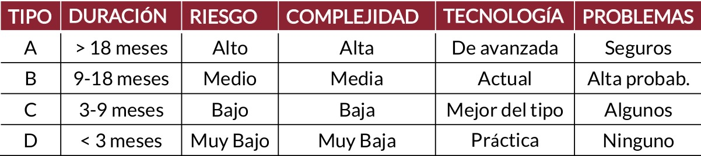

# Practica 1
## Parte I: Conceptos generales  
### 1. Explique con sus palabras en qué consiste un proyecto.  
Un proyecto es una **secuencia de actividades única, complejas y conectadas que tienen un objetivo o propósito y que deben ser completadas en un tiempo específico, dentro del presupuesto y de acuerdo a las especificaciones.**   
- es cualquier actividad que dé como resultado un producto o un “entregable”
- es una organización temporal creada con el propósito de entregar uno o más productos empresariales dentro de las restricciones de costo, calidad y recursos
### 2. Indique cuál es el trabajo de un líder de proyecto. Nombre al menos cinco tareas del mismo.  
Es el responsable de detectar las necesidades de los usuarios y gestionar los recursos económicos, materiales y humanos, para obtener los resultados
esperados en los plazos previstos y con la calidad necesaria.

Tareas:  
- desarrollar el plan del proyecto
- identificar requerimientos y el alcance del proyecto
- comunicar y reportar a interesados
- administrar recursos humanos y materiales
- controlar tiempos
- identificar y controlar riesgos
- administrar costos y presupuesto
- asegurar de la calidad
- evaluar el desempeño del proyecto
### 3. Enumere y explique cuáles son los parámetros o restricciones que afectan a los proyectos.  
1) **Alcance:** es un enunciado que define los límites del proyecto. Dice lo que se va a hacer, pero implícitamente también dice lo que no se va a hacer.
   - es crítico que el alcance sea correcto.
   - el alcance puede cambiar
   - en caso de que se produzca un cambio al alcance, detectarlo y decidir como acomodar el plan del proyecto es un desafío del líder de proyecto.
2) **Calidad:** Existen dos calidades a tener en cuenta en el desarrollo:
    - calidad del producto
    - calidad del proceso
3) **Costo:** es el presupuesto disponible para completar el proyecto.
4) **Tiempo:** es la ventana de tiempo en la cual el proyecto debe terminarse.
5) **Recursos:** son activos, tales como personas, equipos, facilidades físicas, o artefactos necesarios para la realización del proyecto.
    - tienen disponibilidad limitada, su uso puede planificarse, o puede ser contratado a una tercera parte.
    - algunos son fijos y otros variables a largo plazo.
    - son centrales a la planificación de las actividades del proyecto y para la finalización ordenada del mismo.
    - para los proyectos de desarrollo de sistemas, las personas constituyen el recurso más importante.
### 4. ¿En qué consiste el “Triángulo de alcance”? Explique el concepto.  
Representa la relación entre tres restricciones clave que deben equilibrarse para lograr el éxito del proyecto:

- **Alcance (Scope):** Se refiere a las funcionalidades y características que el producto final debe incluir. Un aumento en el alcance implica más trabajo y puede requerir más tiempo o recursos.  
- **Tiempo (Time):** Es el plazo disponible para completar el proyecto. Reducir el tiempo puede afectar la calidad o requerir más recursos.  
- **Costo (Cost):** Representa el presupuesto y los recursos asignados al proyecto. Si se reduce el presupuesto, podría impactar en el tiempo o en la calidad del producto final.
  
El principio clave del Triángulo de Alcance es que modificar una de estas restricciones afecta inevitablemente a las demás. Por ejemplo:  
- **Si se aumenta el alcance sin cambiar el tiempo o el costo, el equipo puede sufrir sobrecarga de trabajo o verse obligado a reducir la calidad.**  
- **Si se reduce el tiempo, es posible que se necesiten más recursos (mayor costo) o que se deba reducir el alcance.**  
- **Si se reduce el costo, puede ser necesario disminuir el alcance o extender los plazos.**  
### 5. Identifique las etapas que forman parte de un proyecto y describa en pocas palabras en qué consiste cada una.  
### 6. Explique cómo se pueden clasificar los proyectos de software.  
1) Duración
1) Riesgo
2) Complejidad
3) Valor comercial
4) Costo  
 

 
### 7. Enumere y ejemplifique causas de fracaso de proyectos.  
1) **No prestar la suficiente atención a...**
    - caso de negocio
    - calidad
    - definición y medida de los entregables
2) **Inadecuada...**
    - definición de responsabilidades
    - planificación y coordinación de recursos 
3) **Pobre estimación de...**
    - duración
    - costos
4) **Falta de...**
    - comunicación con los interesados
    - compromiso de los interesados
    - control de calidad
    - control de avance
### 8. Revise y compare las definiciones de administración de proyectos vistas en clase y otras disponibles en la Web (debe citar las definiciones utilizadas). En base a esas definiciones, se pide:  
- **Identificar aspectos comunes.**  
  - Uso de conocimientos y habilidades.​
  - Empleo de herramientas y técnicas.​
  - Enfoque en procesos como iniciar, planificar, ejecutar, controlar y cerrar.​
  - Orientación al cumplimiento de requisitos del proyecto.​
- **Identificar aspectos mencionados que considere importantes y justificar.**  
  - **Planificación:** Establece una guía clara y anticipa desafíos.​
  - **Delegación:** Asigna tareas eficientemente según competencias.​
  - **Seguimiento y control:** Asegura alineación con objetivos y permite ajustes oportunos.​
  - **Motivación del equipo:** Incrementa productividad y compromiso.
- **Enumerar ventajas de una buena administración de proyectos.**  
    1) mínimo costo
    2) mínimo tiempo
    3) buena calidad
### 9. Cite los desafíos de la administración de proyectos. Indique qué puede hacerse para cumplirlos.  
- Alto nivel de innovación
- Complejidad
- Requerimientos ambiguos
- Falta de competencias necesarias
- Herramientas y técnicas inmaduras
- Administrar personal con diferentes niveles de productividad
- Administrar equipos distribuidos en diferentes ubicaciones
- Administrar entornos multi-culturales y multi-lingua.
- Cumplir con regulaciones de gobierno
- Cumplir con plazos
- Tratar con proveedores
- Reportar a altas autoridades
- Retener personal calificados
### 10. Mencione y explique con sus palabras cómo es el ciclo de vida de un proyecto. 
1) **Inicio:** Se define la necesidad, los objetivos y la viabilidad del proyecto.
2) **Planificación:** Se elabora un plan detallado con tareas, costos y riesgos.
3) **Ejecución:** Se realiza el trabajo siguiendo el plan.
4) **Monitoreo y Control:** Se supervisa el progreso y se ajusta si es necesario.
5) **Cierre:** Se entregan los resultados y se documenta lo aprendido.
### 11. Explique qué es un programa. Mencione diferencias entre programas y proyectos.  
Un programa es un conjunto de proyectos interrelacionados que se gestionan de manera coordinada para **<u>obtener beneficios</u>** que no podrían lograrse si se gestionaran por separado. 
| Aspecto                    | Proyecto                                                                                  | Programa |
| -------------------------- | ----------------------------------------------------------------------------------------- | -------- |
| alcance                    | limitado con productos concretos                                                          | amplio, cambiar para satisfacer las expectativas de beneficios |
| cambios                    | se mantienen al minimo                                                                    | se esperan cambios, e incluso se aceptan                       |
| exito                      | medido por presupuesto, tiempo de entrega y productos que cumplen especificaciones        | se mide en términos de retorno de la inversión (ROI), nuevas capacidades y prestaciones para la organización |
| liderazgo                  | centrado en entrega de tareas y orientado hacia el cumplimiento de los criterios de exito | centrado en la gestión de las relaciones y la resolución de conflictos |
| personal a cargo del lider | técnicos y especialistas                                                                  | lideres de proyecto |
| rol del lider              | motivar, planificacion detallada para administrar la entrega de productos y servicios     | visión y liderazgo, crean planes de alto nivel que proporcionan orientación a los proyectos |
### 12. ¿Cuál es la relación entre la administración de programas y la administración de proyectos?  
- **Jerarquía y dependencia:**
  - Un programa está compuesto por varios proyectos que se gestionan de manera coordinada para alcanzar un objetivo estratégico.
  - Cada proyecto dentro del programa tiene su propio equipo, presupuesto y cronograma, pero todos contribuyen a los objetivos del programa.

- **Objetivo:**  
  - La administración de proyectos se enfoca en cumplir con los objetivos, plazos y entregables de un solo proyecto.
  - La administración de programas coordina múltiples proyectos, asegurando que trabajen en sinergia para generar beneficios adicionales y alinearse con la estrategia organizacional.

- **Optimización de recursos:**  
  - La administración de programas busca optimizar recursos entre los proyectos, evitando redundancias y maximizando el impacto general.
  - La administración de proyectos se centra en la gestión eficiente dentro del alcance específico del proyecto.

- **Gestión de riesgos y cambios:**  
  - La administración de programas identifica riesgos y oportunidades que afectan a múltiples proyectos, permitiendo ajustes estratégicos.
  - La administración de proyectos gestiona riesgos específicos del proyecto, sin necesariamente considerar impactos en otros proyectos.

## Parte II: Actividades y tareas de proyectos
### 13. Explique qué es Work Breakdown Structure (WBS) y cómo se construye.  
**WBS:** es una descripción jerárquica del trabajo que se debe realizar para completar el proyecto.
- Es similar a una descomposición funcional.
- El trabajo se divide en actividades.
- Las actividades se dividen en tareas.

Su construcción es responsabilidad del Líder del proyecto y existen 2 formas de hacerlo:
1) **Top-Down**
   - **Equipo completo:**
     - Participan todos los miembros y comienzan en el nivel 0.
     - Al particionarse las estimaciones de tiempo y costo son mas precisas.
     - Una vez definidas las actividades y tareas, se secuencian, se analiza si pueden hacerce concurrentemente.
     - Como ventaja todos prestan atención y el WBS se discute en el momento.
   - **Sub-equipos:**
     - Todo el equipo decide la particion de primer nivel.
     - Hay tantos subequipos como actividades en el nivel 1.
     - Cada subequipo particiona una actividad para la que tiene experiencia.
     - Los subequipos pueden pedir ayuda externa.
     - Como ventaja demora menos tiempo .
2) **Bottom-Up**
   - Todo el equipo decide la particion de primer nivel.
   - Hay tantos subequipos como actividades en el nivel 1.
   - Cada subequipo particiona una actividad para la que tiene experiencia.
   - Se resuelve con Brainstorming.
   - Se reunen todos los grupos y cada grupo presenta sus resultados.
   - Se discute enconjunto.
   - La desventaja de este enfoque es no definir las tareas con el suficiente grado degranularidad.
### 14. Mencione los distintos usos del WBS en la administración de proyectos.  
1) **Diseñar y planificar el trabajo:** permite a los integrantes del equipo visualizar cómo puede definirse y administrarse el trabajo del proyecto.
2) **Diseñar la arquitectura:** es un gráfico del trabajo del proyecto, muestra cómo se relacionan los distintos ítems de trabajo a realizar.
3) **Planificar:** se debe estimar esfuerzo , tiempos, y recursos para el último nivel.
4) **Informar el estado del proyecto:** es usada como una estructura para mostrar el grado de avance.
### 15. Indique cuáles son las características que deben tener las actividades para considerarse completas. Explique.
1) **Estado medible:**
   - en cualquier momento se debería poder determinar el estado en que se encuentra.
2) **Acotada:**
   - debe poseer evento y fecha de comienzo y fin 
3) **Producir un entregable:**
    - un producto
    - un documento
    - la autorización para continuar con la próxima tarea,
1) **Tiempo y costo estimable:**
    - El tiempo y costo deben ser fácilmente estimables.
    - Realizar la estimación de tiempo y costo para las tareas de menor nivel, permite luego agregar y calcular el costo y tiempo total del proyecto.
2) **Duración aceptable:**
    - máximo de 10 dias hábiles (2 semanas), aunque existen excepciones
3) **Independiente:**
    - Una vez que se comenzó una actividad se debe poder continuar razonablemente sin interrupciones y sin la necesidad de un input adicional.
### 16. Explique qué es la duración de una actividad. Indique cuál es la diferencia con el esfuerzo de trabajo.  
- **Duración** es el tiempo transcurrido en días laborables para finalizar el proyecto -sin considerar feriados, fines de semana, días no laborables-.
- **Esfuerzo de Trabajo** es la labor requerida para completar una actividad. La labor se puede realizar en horas consecutivas o no.

 

**La duración es diferente al esfuerzo de trabajo.**  
- **Duración: 10 días**
- **Esfuerzo de trabajo: 20 horas**  

La duración de una actividad es influenciada por la cantidad de recursos planificados para trabajar en ella.  
Se dice influenciada, ya que no es una relación lineal directa entre la cantidad de recursos asignados a la tarea y la duración de la misma.  
**Crash de la Actividad:** agregar más recursos para mantener la duración de una actividad dentro de los límites planificados.

**Crashpoint de la Actividad:** es el punto en el cual agregar más recursos aumenta la duración de la actividad.
### 17. ¿Cuáles son las causas de variación en la duración de una actividad?  
1) **variación en los perfiles**  
    - estimar la duración basados en personas con un determinado perfil para la actividad.
2) **eventos inesperados**  
    - demoras de proveedores
    - fallas de energía
    - enfermedades
    - problemas técnicos
3) **eficiencia del tiempo de trabajo**  
    - trabajar de manera focalizada y sin interrupciones
4) **errores e interpretaciones erróneas**  
### 18. Mencione las distintas técnicas para estimar esfuerzo.
1) **similitud con otras actividades**
    - Estimar en base a las estimaciones de actividades similares de otros proyectos. "queda en la memoria de la persona"
2) **datos históricos**
    - Estimar en base a las estimaciones de actividades similares de otros proyectos.
    - La base de datos histórica puede ser tan sofisticada como se desee.
3) **juicio experto**
    - Las estimaciones las realizan consultores externos o vendedores con experiencia en la metodología o en la tecnología.
4) **técnica Delphi**
    - primera pasada
      - Cada miembro del grupo realiza su estimación y se ponen las mismas en una tabla
    - segunda pasada
      - los que estimaron la mínima y máxima duracion defiendan su postura
      - vuelven a votar y se pone nuevamente en una tabla
    - tercera pasada
      - nuevamente se hace otra estimacion
      - con estos ajustes finales se pone en otra tabla
      - **el promedio de la tercera pasada es el esfuerzo estimado**
5) **técnica de 3 puntos**  
- **Estimación Optimista:** todo va por el camino feliz.  
- **Estimación Pesimista:** ley de murphy.  
- **Estimación Media:** la duración normal (usual) de la actividad.  
  - **Estimación = (Optimista + 4*Media + Pesimista)/6**  
1) **técnica Delphi de banda ancha**
    - Es una combinación de la técnica Delphi y la de 3 Puntos.
    - a cada integrante se le pide que haga las 3 estimaciones: optimista, pesimista y media.
    - Se recopilan los resultados y se eliminan los extremos.
    - Se calculan los promedios de optimistas, pesimistas y medias.
    - Se calcula con la fórmula de 3 Puntos utilizando los promedios.

## Parte III: Costos
### 19. Explique a qué se hace referencia con el término “Estimación de costos”.
Predicciones de cuanto tiempo, esfuerzo y perfiles de RRHH son requeridos para construir un sistema de software 

### 20. ¿Cuáles son las técnicas de estimación y para qué se utilizan?
- **Opinión Experta:** toma ventaja de la experiencia de un personal de desarrollo senior. El desarrollador describe los parámetros del proyecto y el experto hace predicciones basadas en experiencias previas. 
- **Analogía:** los estimadores comparan el proyecto propuesto con proyectos pasados. Identifican similitudes y diferencias. Es mas visible. Exige definir características claves.
- **Descomposición:** El análisis se focaliza en el producto o en las tareas requeridas para construirlo. Se basa en la descomposición del producto en componentes y de las actividades en tareas. Se basan en casos promedios o experiencias pasadas.
- **Modelos:** son técnicas que identifican contribuyentes claves al esfuerzo, generando fórmulas matemáticas que relacionan estos items al esfuerzo. Estas técnicas se pueden aplicar con los siguientes enfoques: 
  - **Bottom-Up:** comienza con las partes de menor nivel y provee estimaciones para cada una de ellas. 
  - **Top-Down:** estima el producto o proceso completo. Las estimaciones para cada componente son calculadas como porciones relativas del todo.   

**<u>La Estimación de Costos tiene dos usos:</u>**  
- **en planificación:** se necesita saber cuantos recursos va a insumir 
- **en control:** se necesita saber cuanto se hizo y cuanto falta.
**Se necesitan métodos predictivospara estimar la complejidad del software antes de que sea desarrollado. **

### 21. El modelo COCOMO original es una colección de tres modelos: (**Explique las diferencias entre estos modelos.**)
**a. Básico:** aplicable cuando se conoce muy poco del proyecto

**b. Intermedio** aplicable luego de la especificación de requerimientos

**c. Avanzado o detallado** aplicable cuando se termina el diseño

### 22. Los modelos calculan el esfuerzo requerido E a través de una fórmula de la forma: E = a x Sb x F , y la duración estimada a través de la fórmula: D = c x E d
**a. ¿Qué valor toma F para el modelo básico?**  
F (Factor de ajuste) toma el valor 1 para el modelo básico ya que no tiene en cuenta los conductores de costos.

**b. Describir brevemente en función de qué tipos de variables se calcula el factor de ajuste F en los otros dos modelos.**  
F se calcula también en función de las siguientes variables **<u>Atributos de Costos</u> o <u>Conductores de Costos</u>**.  
Estas tratan de capturar el impacto del entorno del proyecto en el costo de desarrollo.   
De un análisis estadístico de más de 100 factores que influencian el costo, Boehm retuvo 15 de ellos para COCOMO. 
Se agrupan en cuatro categorías: 
1) **atributos del producto**
2) **atributos del hardware** 
3) **atributos del personal**
4) **atributos del proyecto**

**c. Indicar cómo varían los valores de a y b, y c y d en ambas fórmulas de acuerdo al modo utilizado.** 
se obtienen de tablas del modelo en función del tipo de sistema

**d. Describir las características generales de sistemas que apliquen a cada uno de estos modos: Dar ejemplos.**  
- **orgánicos:** involucra procesamiento de datos, uso de bases de datos y se focaliza en transacciones y recuperación de datos. 
  - **Ejemplo: sistema de facturación**
- **embebido:** contiene software de tiempo real que es una parte integral de un sistema mayor basado en hardware.
  - **Ejemplo: control de ascensores**  
- **semi-embebido:** entre orgánico y embebido – presenta mayor procesamiento de transacciones. 
  - **Ejemplo: monitoreo de una red**

### 23. ¿Cuáles son los principales objetivos considerados en el desarrollo del modelo COCOMO 2.0? Explique diferencias con la versión original.
El modelo original de COCOMO resultó muy exitoso, sin embargo su aplicación no es práctica para entornos modernos de desarrollo.  
 

**Surge COCOMO II, cuyos objetivos son:**
- desarrollar modelos de costos y de estimación acordes a las prácticas actuales 
- desarrollar bases de datos de costos y herramientas que soporten una mejora continua del modelo
- proveer un framework analítico cuantitativo, y un conjunto de herramientas y técnicas para evaluar los efectos de las mejoras en los costos de ciclos de vida y en las planificaciones

**COCOMO II está compuesto por tres modelos:**
- **Modelo de la Aplicación:** basado en Puntos Objeto
- **Modelo de Diseño Temprano:** usado para obtener estimaciones de costo y duración antes de finalizar el diseño de la arquitectura
- **Modelo Post-Arquitectura:** el modelo más detallado, con nuevos conductores de costos, y nuevas ecuaciones 

### 24. Explique qué es la economía de escala. De al menos dos ejemplos.
En COCOMO II el esfuerzo es expresado en Personas Mes (PM).  
**<u>PM nominal = A * (Tamaño)B</u>**  
- El **Tamaño** es expresado en **KSLOC**.
- **A:** intenta cuantificar los efectos multiplicativos en el esfuerzo de proyectos de tamaño creciente 
- **B:** intenta medir la economía (o no economía) de escala encontrada en proyectos de diferentes tamaños. 
  - Si **B < 1.0** -> el proyecto exhibe economía de escala <u>(la productividad aumenta a medida que aumenta el tamaño del producto)</u> 
  - Si **B = 1.0** -> la economía, o no economía están balanceadas 
  - Si **B > 1.0** -> el proyecto no exhibe economía de escala <u>(aumento de comunicación, problemas de integración)</u>
 

- Ejemplo de **economía de escala** -> uso de herramientas CASE
- Ejemplo de **no economía de escala** -> mayor comunicación, y dependencias

## Parte IV: Gestión de proyectos
### 25. Explicar qué es la gestión de los beneficios y en qué consiste su enfoque.
### 26. ¿Cuáles son las características principales de la gestión de los interesados?
### 27. Indicar cuáles son los objetivos de la gestión de los interesados y a qué preguntas responde.
### 28. ¿De qué forma se representa la identificación de los interesados y sus intereses? Ejemplifique.
### 29. Indique qué datos se incluyen al momento de crear una matriz de impacto y qué aporta el análisis de los mismos.
### 30. ¿Qué datos tiene un plan de comunicación dentro de la gestión de los interesados? Mencione posibles canales de comunicación.

## Parte V: Ejercicios
### 31. Una empresa vende seguros para bienes inmuebles. Cuenta con 10 empleados de planta y 20 vendedores contratados. En base a requerimientos de los directivos, la Gerencia de Sistemas definió la ejecución de dos proyectos para el período 2017-2018:
#### 1. Comprar dispositivos móviles para ayudar a los 20 vendedores en sus tareas diarias.
#### 2. Proveer un sistema de sueldos y jornales.
**Para cada proyecto se pide:**  
**a. Clasificarlo y justificar dicha clasificación.**  
**b. Identificar al menos 3 tareas que sería necesario ejecutar en cada proyecto – analizar si están conectadas y en caso afirmativo, explicar cómo.**  
**c. Explicar dos situaciones que puedan hacer fracasar el proyecto.**  
### 32. Elegir una organización y describir a qué se dedica (cuál es su misión). Formular un objetivo estratégico para el cual se necesite la ejecución de un programa y luego:
**a. Identificar un programa para la implementación del objetivo estratégico que incluya al menos tres proyectos.**  
**b. Explicar por qué los proyectos forman parte del programa.**  
### 33. Una importante empresa de servicios de salud, con más de 20.000 empleados, tiene como proyecto proveer a sus empleados un sistema online que los ayude a mejorar y mantener su estado de salud. Hoy en día, la empresa paga un 20% más que el promedio del mercado en servicios de salud prepaga. Se cree que, con este sistema, se mejorará la salud de sus empleados y se podrán negociar mejores precios con la prepaga, ahorrando al menos $150 al año por empleado. Se busca terminar el proyecto en 6 meses con un presupuesto de $500 000. El sistema requiere:
- **Permitir a los empleados registrarse a programas de recreación patrocinados por la compañía, tales como fútbol, básquet, ciclismo y otros deportes.**
- **Permitir a los empleados registrarse a programas y clases para ayudarlos a controlar su peso, reducir el stress, dejar de fumar, etc**
- **Monitorear datos sobre los empleados que se involucran en esas actividades recreacionales y esos programas de salud.**
- **Ofrecer incentivos a los que se inscriben en los programas y tienen un buen desenvolvimiento en ellos (dejando de fumar, ganando competencias, etc.)**
**Para este proyecto se busca formular una estrategia de gestión de los interesados con:**  
**a. Identificación de al menos tres grupos de interesados.**  
**b. Creación del mapa de partes interesadas.**  
**c. Creación de la matriz de impacto de las partes interesadas.**  
**d. Elaboración de un plan de comunicación.**  
**e. Definición de los canales de comunicación.**  