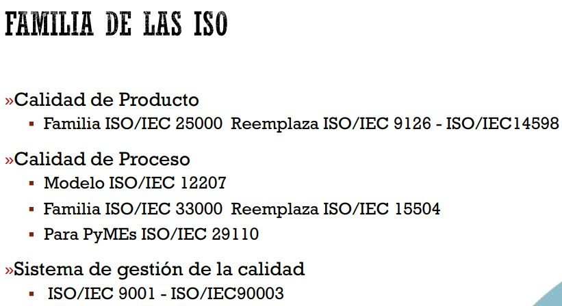
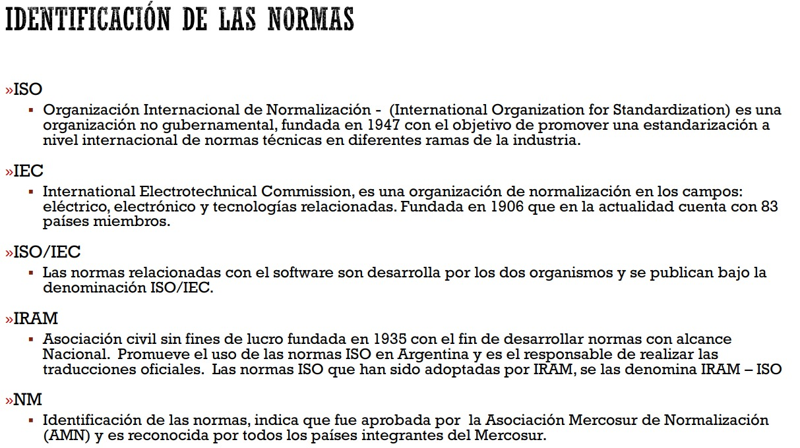
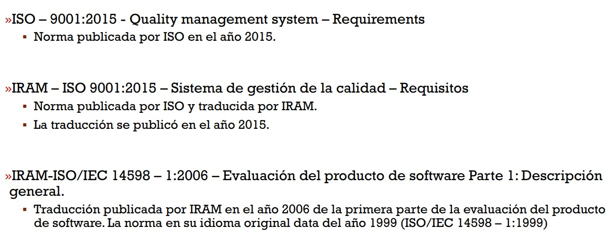

# Practica 2

 

# Parte I: Conceptos generales  
## 1. Describa con sus palabras qué entiende por Calidad.  
Calidad es el grado en que un software satisface las necesidades del usuario, cumple con los requerimientos establecidos y presenta buenas características técnicas que lo hacen confiable, mantenible y eficiente.
## 2. Cada  uno  de  los  denominados  Gurús  (o  Padres)  de  la  Calidad  han  creado  o  instaurado algún  programa,  término  o  proceso  que  los  ha  colocado  en  ese  lugar.  Investigue  y explique con sus palabras el aporte realizado por cada uno de los gurús mencionados en la teoría.
- ***W. Edwards Deming***
  - **Aporte clave:** Ciclo PDCA (Plan-Do-Check-Act) y los 14 principios de gestión para la calidad.
  - **Enfoque:** La calidad es responsabilidad de toda la organización, no sólo del área de control.
  - **Frase célebre:** “El 94% de los problemas del producto provienen del sistema, no de los empleados.”
  - **Aplicación en software:** Promueve la mejora continua y el diseño de procesos robustos desde el inicio.
- ***Joseph Juran***
  - **Aporte clave:** Trilogía de Juran: planificación, control y mejora de la calidad.
  - **Enfoque:** La calidad se debe gestionar como un proceso integral. Introdujo el término “costos de la calidad”.
  - **Frase célebre:** “La calidad comienza con la educación y termina con la responsabilidad.”
  - **Aplicación en software:** Fomenta la planificación de la calidad como parte del diseño del proyecto, no como una verificación posterior.
- ***Philip Crosby***
  - **Aporte clave:** Concepto de “Cero Defectos” y la idea de que “la calidad no cuesta” (Quality is Free).
  - **Enfoque:** La calidad se logra mediante la prevención y el cumplimiento estricto de los requisitos.
  - **Frase célebre:** “Hacerlo bien desde la primera vez.”
  - **Aplicación en software:** Inspiró enfoques como el TDD (Test Driven Development) y prácticas de calidad desde la codificación.
- ***Kaoru Ishikawa***
  - **Aporte clave:** Diagrama causa-efecto (o espina de pescado) para identificar causas raíz de los problemas.
  - **Enfoque:** Calidad implica participación de todos, desde la dirección hasta los operarios. Introdujo los círculos de calidad.
  - **Frase célebre:** “La calidad comienza y termina con la educación.”
  - **Aplicación en software:** Ayuda en análisis de fallas, revisiones de código, retrospectives y mejora continua en equipos Agile.
- ***Genichi Taguchi***
  - **Aporte clave:** Método Taguchi para diseño robusto. Introduce el concepto de “pérdida de calidad”.
  - **Enfoque:** Minimizar la variabilidad del producto y sus efectos negativos antes de que llegue al cliente.
  - **Frase célebre:** “La calidad debe diseñarse, no inspeccionarse.”
  - **Aplicación en software:** Influyó en pruebas de estrés, diseño de pruebas automatizadas y validación temprana.
- ***Armand Feigenbaum***
  - **Aporte clave:** Introdujo el término “Control Total de Calidad”.
  - **Enfoque:** La calidad debe integrarse en todas las fases del proceso de desarrollo, no sólo al final.
  - **Frase célebre:** “La calidad es un trabajo de todos.”
  - **Aplicación en software:** Fue precursor de los sistemas de aseguramiento de calidad (QA) como parte del ciclo de vida del software.
- ***Walter A. Shewhart***
  - **Aporte clave:** Precursor del control estadístico de procesos (SPC) y mentor de Deming.
  - **Enfoque:** Uso de datos y estadística para monitorear y mejorar la calidad.
  - **Aplicación en software:** Su enfoque inspiró prácticas de monitoreo continuo de procesos de desarrollo y métricas de calidad de código.

## 3. Explique con sus palabras qué es la Calidad del Software y cómo se divide. 
**La Calidad del Software es la capacidad que tiene un producto de software para satisfacer tanto los requisitos funcionales (lo que el sistema debe hacer) como los no funcionales (cómo lo hace), cumpliendo las expectativas del usuario, siendo confiable, mantenible y eficiente.**  
La calidad del software se puede dividir en dos grandes dimensiones, según el enfoque propuesto por **la norma `ISO/IEC 25010`, que actualiza y amplía la antigua `ISO 9126`:**
1. ***Calidad del producto (Producto Interno/Externo)***  
Es la calidad que se puede observar en el producto en sí mismo, durante su desarrollo o una vez desplegado. Esta dimensión se evalúa en base a 8 características principales, cada una con subcaracterísticas:
- **Adecuación funcional** – Cumple correctamente con sus funciones.
- **Eficiencia de desempeño** – Buen uso de recursos, tiempos de respuesta.
- **Compatibilidad** – Capacidad de funcionar con otros sistemas.
- **Usabilidad** – Facilidad con la que el usuario puede aprender y usar el sistema.
- **Fiabilidad** – El sistema se comporta de forma estable y sin fallas.
- **Seguridad** – Protege la información y los datos del usuario.
- **Mantenibilidad** – Facilidad para modificar, corregir o mejorar el software.
- **Portabilidad** – Facilidad para instalarlo en distintos entornos o sistemas.
2. ***Calidad en uso***  
Es la calidad percibida por el usuario final al interactuar con el software en su contexto real de uso. Se mide en base a 5 características:
- **Eficacia** – Capacidad de lograr el objetivo propuesto.
- **Eficiencia** – Lograr ese objetivo con el menor esfuerzo y recursos.
- **Satisfacción del usuario** – Nivel de aceptación y agrado del usuario.
- **Prevención de errores** – Evita que el usuario cometa fallas.
- **Cobertura de contexto** – Se adapta a distintos tipos de usuarios, entornos y dispositivos.

## 4. ¿Cómo se diferencian los términos Norma y Estándar? Explique. 
- ***Norma***
  - Es un documento oficial, aprobado por un organismo reconocido, que define requisitos obligatorios o recomendados, con un potencial carácter legal o regulatorio.
- ***Estándar***
  - Es una guía técnica aceptada por la comunidad o la industria, que ayuda a alcanzar calidad y uniformidad, aunque no es obligatoria por ley.

 
 

# Parte II: Calidad de Producto 
## 5. Describa el concepto de Calidad de Producto de software. 
La calidad de producto de software se refiere al conjunto de características técnicas que debe tener un sistema para cumplir con los requisitos funcionales y no funcionales establecidos, garantizando que el producto sea correcto, eficiente, seguro y mantenible.  
Este concepto analiza el software como objeto técnico, es decir, se centra en sus propiedades internas y externas, y no tanto en la experiencia del usuario final (eso corresponde a la calidad en uso).  
***Calidad del producto (Producto Interno/Externo)***  
Es la calidad que se puede observar en el producto en sí mismo, durante su desarrollo o una vez desplegado. Esta dimensión se evalúa en base a 8 características principales, cada una con subcaracterísticas:  
- **Adecuación funcional** – Cumple correctamente con sus funciones.
- **Eficiencia de desempeño** – Buen uso de recursos, tiempos de respuesta.
- **Compatibilidad** – Capacidad de funcionar con otros sistemas.
- **Usabilidad** – Facilidad con la que el usuario puede aprender y usar el sistema.
- **Fiabilidad** – El sistema se comporta de forma estable y sin fallas.
- **Seguridad** – Protege la información y los datos del usuario.
- **Mantenibilidad** – Facilidad para modificar, corregir o mejorar el software.
- **Portabilidad** – Facilidad para instalarlo en distintos entornos o sistemas.

## 6. Explique cuáles son los pasos a seguir para realizar una evaluación siguiendo el proceso de evaluación definido en la norma ISO/IEC 14598. 
La evaluación de calidad de software según **la norma ISO/IEC 14598 es un proceso sistemático y estructurado que consta de seis pasos: definir propósito, especificar requisitos, planificar, ejecutar, analizar y documentar**. Se basa en los modelos de calidad como ISO/IEC 25010 y permite asegurar la trazabilidad y objetividad en las decisiones de calidad del producto.  
1. ***Establecer el propósito de la evaluación***
- Definir el objetivo de la evaluación *(ej.: validar una versión, comparar productos, certificar)*.
- Identificar a los destinatarios de los resultados *(clientes, auditores, equipo de desarrollo, etc.)*.
- Aclarar si la evaluación será interna (autoevaluación) o externa (auditoría).
2. ***Especificar los requisitos de calidad***
- Seleccionar las características y subcaracterísticas del modelo ISO/IEC 25010 que serán evaluadas (adecuación funcional, usabilidad, mantenibilidad, etc.).
- Establecer criterios de aceptación y métricas asociadas.
- Definir el nivel de calidad deseado o requerido para el producto.
3. ***Establecer el plan de evaluación***
- Detallar el método de evaluación: qué se va a medir, con qué herramientas, en qué momento.
- Establecer recursos necesarios (humanos, tecnológicos, temporales).
- Determinar cómo se documentarán los resultados.
4. ***Realizar la evaluación***
- Aplicar los métodos definidos.
- Recoger evidencia objetiva y medible.
- Ejecutar pruebas, inspecciones, análisis estáticos o dinámicos, según el plan.
5. ***Analizar los resultados***
- Interpretar los resultados obtenidos en función de los criterios definidos.
- Verificar si se cumplen los niveles deseados de calidad.
- Identificar áreas de incumplimiento o mejora.
6. ***Emitir el informe de evaluación***
- Documentar de forma clara, trazable y verificable los resultados.
- Incluir conclusiones, recomendaciones y observaciones.
- Comunicar el informe a los destinatarios definidos en el paso 1.

## 7. Describa el Modelo de Calidad de la `ISO/IEC 9126`.  
El modelo de calidad de la **`ISO/IEC 9126` define la calidad del software a través de 6 características principales y sus respectivas subcaracterísticas**. Estas **permiten evaluar tanto la calidad técnica del producto como su utilidad percibida por el usuario**. Aunque ha sido reemplazado por la norma `ISO/IEC 25010`, sigue siendo fundamental como modelo fundacional en la ingeniería del software.
- **Permite medir la calidad interna y externa del producto**.
- Sirve de **base conceptual para modelos posteriores como la `ISO/IEC 25010`**.
- **Es un modelo multidimensional, donde cada característica se evalúa de forma independiente pero articulada**.

## 8. Enumere las características que presenta la `ISO/IEC 9126-1`. 
- ***Funcionalidad***
  - Capacidad del software para proporcionar funciones que satisfacen necesidades explícitas e implícitas.
  - **Subcaracterísticas:** adecuación, exactitud, interoperabilidad, cumplimiento funcional, seguridad de acceso.
- ***Fiabilidad***
  - Capacidad para mantener su nivel de desempeño bajo condiciones específicas durante un tiempo determinado.
  - **Subcaracterísticas:** madurez, tolerancia a fallos, capacidad de recuperación.
- ***Usabilidad***
  - Facilidad con la que los usuarios pueden aprender a utilizarlo y operarlo correctamente.
  - **Subcaracterísticas:** comprensibilidad, aprendibilidad, operabilidad, atractivo.
- ***Eficiencia***
  - Relación entre el desempeño del software y la cantidad de recursos usados en condiciones determinadas.
  - **Subcaracterísticas:** comportamiento en tiempo y utilización de recursos.
- ***Mantenibilidad***
  - Facilidad con la que el software puede ser analizado, modificado y probado.
  - **Subcaracterísticas:** analizabilidad, modificabilidad, estabilidad, capacidad de prueba.
- ***Portabilidad***
  - Capacidad del software para ser transferido de un entorno a otro.
  - **Subcaracterísticas:** adaptabilidad, instalabilidad, coexistencia, reemplazabilidad.

## 9. Las métricas de la `ISO/IEC 9126-2` están definidas en forma de tabla. Explique cuáles son los componentes de esta tabla y qué criterios brinda la norma para la creación de nuevas métricas. 
Las tablas de métricas de la norma `ISO/IEC 9126-2` están compuestas por:  

- ***Nombre de la subcaracterística***
  - Se especifica cuál de las subcaracterísticas del modelo `ISO/IEC 9126-1` está siendo medida *(por ejemplo, exactitud, interoperabilidad, etc.)*.
- ***Nombre de la métrica***
  - Es el identificador o título que describe la métrica específica *(por ejemplo, "número de errores detectados por unidad funcional")*.
- ***Propósito***
  - Explica qué mide la métrica y para qué sirve. Permite entender su relación con la calidad del producto.
- ***Método de medición***
  - Describe cómo se calcula la métrica, incluyendo fórmulas o procedimientos concretos.
  - Puede ser cuantitativo *(numérico)* o cualitativo *(observacional)*.
- ***Unidad de medida***
  - Se aclara en qué unidades se expresa la métrica *(porcentaje, número entero, tiempo, etc.)*.
- ***Tipo de escala***
  - Indica si la escala es nominal, ordinal, de intervalo o de razón, lo que influye en el análisis posterior *(por ejemplo, si se pueden promediar valores o sólo clasificar)*.
 
Para definir nuevas métricas, la norma recomienda que estas sean relevantes, claras, reproducibles, objetivas, simples y comparables.  

- ***Relevancia respecto a la subcaracterística***
  - La nueva métrica debe tener una relación directa con el atributo de calidad que se desea evaluar.
- ***Claridad en el propósito***
  - Debe quedar claro qué se mide y por qué. La métrica debe estar bien justificada.
- ***Reproducibilidad***
  - Su aplicación debe poder ser replicada por distintas personas sin ambigüedades.
- ***Objetividad***
  - Siempre que sea posible, debe ser cuantificable y no depender de apreciaciones subjetivas.
- ***Simplicidad y costo razonable***
  - Debe ser sencilla de aplicar y no implicar un esfuerzo desproporcionado en relación al beneficio que aporta.
- ***Comparabilidad***
  - Debe permitir comparar entre versiones del producto o entre productos distintos, lo que es clave en contextos de evaluación de calidad.

## 10.   Mencione cuáles son los niveles de puntuación de las métricas.
Los niveles de puntuación de las métricas, según la norma ISO/IEC 9126-2, se definen mediante el tipo de escala utilizada: nominal, ordinal, de intervalo y de razón.  
- ***Nominal***
  - Clasifica datos en categorías sin orden.
  - No se pueden ordenar ni operar matemáticamente.
  - **Ejemplo:** Tipo de error *(sintáctico, lógico, de interfaz)*.
- ***Ordinal***
  - Clasifica datos con un orden, pero sin distancias precisas entre ellos.
  - Permite comparar, pero no calcular promedios.
  - **Ejemplo:** Nivel de severidad de un error *(leve, medio, crítico)*.
- ***Intervalo***
  - Escala con valores numéricos ordenados y distancias iguales, pero sin un cero absoluto.
  - Permite sumas y restas, pero no proporciones.
  - **Ejemplo:** Tiempo de respuesta medido en una escala arbitraria.
- ***Razón***
  - Escala más completa: valores numéricos con orden, distancia y cero absoluto.
  - Permite todas las operaciones matemáticas.
  - **Ejemplo:** Número de errores, porcentaje de disponibilidad, tiempo en segundos.

Estas escalas determinan el grado de análisis que puede hacerse con los valores obtenidos y cómo se interpretan los resultados.  

## 11.   Explique de qué forma se deben combinar los niveles de las métricas para establecer los niveles de las características y de evaluación. 
Para establecer los niveles de evaluación de una característica de calidad del software, primero se combinan los niveles de las métricas que miden cada subcaracterística, y luego se combinan las subcaracterísticas para obtener el nivel final de la característica.  
La norma permite distintos métodos de combinación (cuantitativos o cualitativos), siempre que sean coherentes, justificados y reproducibles.  
- 1. ***Combinación de métricas → Subcaracterísticas***
  - Cada subcaracterística de calidad (por ejemplo, exactitud, dentro de funcionalidad) se evalúa a partir de una o varias métricas específicas.
  - Estas métricas pueden tener distintos niveles de puntuación *(nominal, ordinal, etc.)*.
  - Para combinarlas, la organización debe definir una estrategia de agregación, como puede ser:
    - **Promedio ponderado**
    - **Reglas de decisión** *(por ejemplo: si falla alguna métrica crítica, la subcaracterística se considera deficiente)*
    - **Clasificación cualitativa** basada en rangos
  - **Ejemplo:** Para evaluar la usabilidad, podríamos medir:  
    - Tiempo para realizar tareas
    - Número de errores del usuario
    - Nivel de satisfacción en encuestas
  - Cada una puede tener escalas distintas, por lo que se deben normalizar o transformar para luego combinarlas.

- 2. ***Combinación de subcaracterísticas → Característica***
  - Una vez evaluadas todas las subcaracterísticas, se combinan entre sí para asignar un nivel de evaluación a la característica global.
  - Esto también se hace mediante:
    - **Agregación cuantitativa** *(por ejemplo, promedio de subcaracterísticas ponderadas)*
    - **Evaluación cualitativa basada en criterios** *(por ejemplo: "alta usabilidad" si 3 de 4 subcaracterísticas son "buenas")*

- ***Importante***
  - La norma no impone un único método de combinación, pero exige que el método sea definido, documentado y justificable.
  - Esto es parte del principio de transparencia y trazabilidad en la evaluación de calidad.

## 12.   Explique cómo se conforma la familia ISO/IEC 25000 (SQuaRE). 
## 13.   ¿Qué  norma  de  la  familia  ISO/IEC  25000  reemplaza  a  la  ISO/IEC  9126-1?  Explique  las diferencias. 
## 14.   ¿Qué  norma  de  la  familia  ISO/IEC  25000  reemplaza  a  la  ISO/IEC  14598?  Explique  las diferencias.                        

# Parte III: Calidad de Datos 
## 15.   Describa el concepto de Calidad de Datos IS0/IEC 25012. 
## 16.   Defina la clasificación propuesta por el modelo. 
 
 
# Parte IV: Calidad de Servicio 
## 17.   Describa el concepto de Calidad de Servicio ISO/IEC 20000. 
## 18.   Explique cómo se organiza el estándar. 

# Parte V: Calidad de Procesos de Software 
## 19.   Explique con sus palabras qué es un proceso. 
## 20.   ¿A qué se considera “Proceso de Software”? 
## 21.   Describa el Modelo de Calidad de Procesos de Software ISO/IEC 12207. 
## 22.   Describa  el  Modelo  de  Capacidad  de  Mejora  de  Procesos  de  Software  ISO/IEC  15504. ¿Qué nueva familia de normas lo reemplaza? Explique las diferencias. 
## 23.   Explique qué significa realizar una certificación bajo la norma IRAM-ISO 9001:2015.  
## 24.   Indique para qué se utiliza la norma ISO 90003. ¿Es posible certificar bajo esta norma? 
## 25.   ¿Qué beneficios trae aplicar un Sistema de Gestión de la Calidad (SGC)? 
## 26.   El “Alcance” del SGC es una descripción resumida del mismo y su naturaleza. Indique qué características debe tener. 
## 27.   Los “Objetivos” del SGC establecen las metas a las que se desea llegar con la certificación y deben suponer un avance, buscando la “mejora continua”. Indique qué características deben tener. 
## 28.   Dados los siguientes objetivos, indicar si están bien escritos y por qué. Reescribir los que no considere correctos de modo que cumplan con las características. 
### a. No tener solicitudes de cambios en los requerimientos funcionales 
### b. Tener pocos errores en los requerimientos funcionales implementados 
### c. Tener   un  desvío  promedio  (por tarea)  entre  el tiempo  insumido  en desarrollo  y  el tiempo estimado menor al 25% 
## 29.   El “Mapa de Procesos” busca  mantener  una  estructura  coherente  de  la  información documentada del sistema.  
### a. Indique cuáles son los tipos de procesos que debe contener y qué representan cada uno de ellos. 
### b. Indique qué significan los clientes en el Mapa de Procesos y qué representan. 
### c. Presente un ejemplo de cada una de las regiones del mapa de procesos. 
 
 
# Parte VI: Ejercicios 
## 30.  Realizar una planificación para la evaluación de productos de software según el modelo de evaluación definido en la ISO/IEC 25040 y las características/métricas de la calidad de producto definidos en la ISO/IEC 25010.  
### 1. Describir  el  producto  a  evaluar:  nombre,  funcionalidad  del  producto,  detalles  que permitan entender el funcionamiento del mismo.  
### 2. Definir un propósito y seleccionar de la ISO/IEC 25010 al menos dos características a evaluar. Justificar la selección.  
### 3. Para  cada  característica elegida  seleccionar tres métricas de  la  ISO/IEC  25023.  En  el caso de necesitar una métrica que no esté definida, se la debe crear respetando los criterios de la norma. 
### 4. Realizar la planificación de la evaluación completando los ítems definidos en ISO/IEC 25040
     
## 31.  Preparar un proceso de desarrollo de un producto de software elegido para la realización de una certificación.  
### 1. Describir la organización desarrolladora de software  
#### a. Reseña histórica 
#### b. Estructura organizativa 
#### c. Productos y servicios que ofrece 
#### d. Mercado al que dirige sus productos/servicios 
#### e. Procesos principales de desarrollo 
#### f. Proveedores  
### 2. Especificar el alcance de la certificación, indicando cuál de los procesos mencionados en el punto “e” se va a certificar y con qué objetivo.  
### 3. Describir  cuáles  serían  los  clientes  del  proceso  a  evaluar  y  sus  necesidades.  ¿Cómo mediría la satisfacción de los clientes?  
### 4. Realizar un SGC para el proceso a certificar con la norma ISO 9001, teniendo en cuenta las directrices de la ISO 90003. El SGC debe contener los siguientes ítems: 
#### a. Alcance del SGC 
#### b. Objetivos del SGC 
#### c. Mapa de procesos