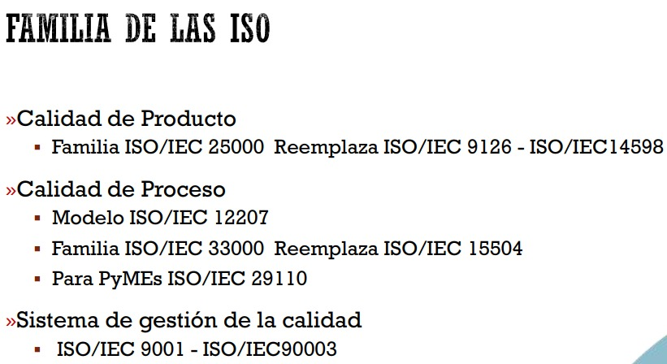
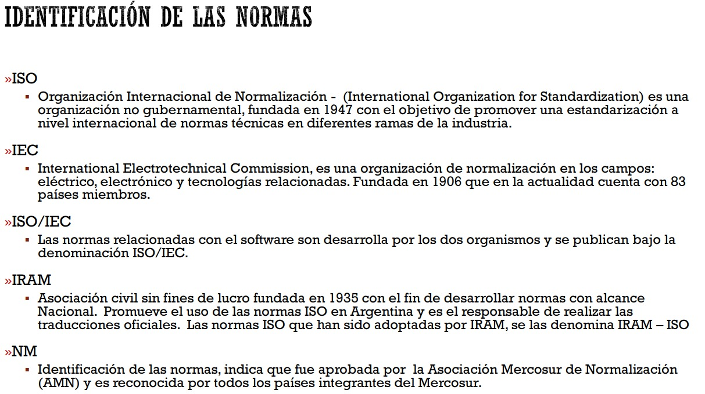
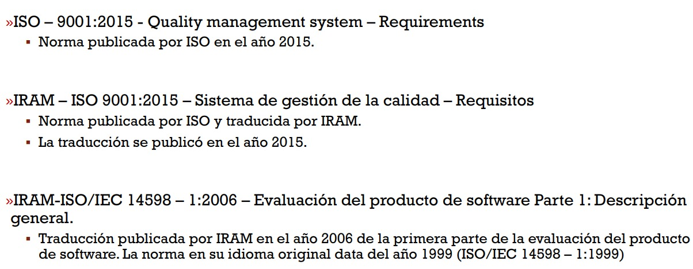

# Practica 2

 

# Parte I: Conceptos generales  
## 1. Describa con sus palabras qué entiende por Calidad.  
Calidad es el grado en que un software satisface las necesidades del usuario, cumple con los requerimientos establecidos y presenta buenas características técnicas que lo hacen confiable, mantenible y eficiente.
## 2. Cada  uno  de  los  denominados  Gurús  (o  Padres)  de  la  Calidad  han  creado  o  instaurado algún  programa,  término  o  proceso  que  los  ha  colocado  en  ese  lugar.  Investigue  y explique con sus palabras el aporte realizado por cada uno de los gurús mencionados en la teoría.
- ***W. Edwards Deming***
  - **Aporte clave:** Ciclo PDCA (Plan-Do-Check-Act) y los 14 principios de gestión para la calidad.
  - **Enfoque:** La calidad es responsabilidad de toda la organización, no sólo del área de control.
  - **Frase célebre:** “El 94% de los problemas del producto provienen del sistema, no de los empleados.”
  - **Aplicación en software:** Promueve la mejora continua y el diseño de procesos robustos desde el inicio.
- ***Joseph Juran***
  - **Aporte clave:** Trilogía de Juran: planificación, control y mejora de la calidad.
  - **Enfoque:** La calidad se debe gestionar como un proceso integral. Introdujo el término “costos de la calidad”.
  - **Frase célebre:** “La calidad comienza con la educación y termina con la responsabilidad.”
  - **Aplicación en software:** Fomenta la planificación de la calidad como parte del diseño del proyecto, no como una verificación posterior.
- ***Philip Crosby***
  - **Aporte clave:** Concepto de “Cero Defectos” y la idea de que “la calidad no cuesta” (Quality is Free).
  - **Enfoque:** La calidad se logra mediante la prevención y el cumplimiento estricto de los requisitos.
  - **Frase célebre:** “Hacerlo bien desde la primera vez.”
  - **Aplicación en software:** Inspiró enfoques como el TDD (Test Driven Development) y prácticas de calidad desde la codificación.
- ***Kaoru Ishikawa***
  - **Aporte clave:** Diagrama causa-efecto (o espina de pescado) para identificar causas raíz de los problemas.
  - **Enfoque:** Calidad implica participación de todos, desde la dirección hasta los operarios. Introdujo los círculos de calidad.
  - **Frase célebre:** “La calidad comienza y termina con la educación.”
  - **Aplicación en software:** Ayuda en análisis de fallas, revisiones de código, retrospectives y mejora continua en equipos Agile.
- ***Genichi Taguchi***
  - **Aporte clave:** Método Taguchi para diseño robusto. Introduce el concepto de “pérdida de calidad”.
  - **Enfoque:** Minimizar la variabilidad del producto y sus efectos negativos antes de que llegue al cliente.
  - **Frase célebre:** “La calidad debe diseñarse, no inspeccionarse.”
  - **Aplicación en software:** Influyó en pruebas de estrés, diseño de pruebas automatizadas y validación temprana.
- ***Armand Feigenbaum***
  - **Aporte clave:** Introdujo el término “Control Total de Calidad”.
  - **Enfoque:** La calidad debe integrarse en todas las fases del proceso de desarrollo, no sólo al final.
  - **Frase célebre:** “La calidad es un trabajo de todos.”
  - **Aplicación en software:** Fue precursor de los sistemas de aseguramiento de calidad (QA) como parte del ciclo de vida del software.
- ***Walter A. Shewhart***
  - **Aporte clave:** Precursor del control estadístico de procesos (SPC) y mentor de Deming.
  - **Enfoque:** Uso de datos y estadística para monitorear y mejorar la calidad.
  - **Aplicación en software:** Su enfoque inspiró prácticas de monitoreo continuo de procesos de desarrollo y métricas de calidad de código.

## 3. Explique con sus palabras qué es la Calidad del Software y cómo se divide. 
**La Calidad del Software es la capacidad que tiene un producto de software para satisfacer tanto los requisitos funcionales (lo que el sistema debe hacer) como los no funcionales (cómo lo hace), cumpliendo las expectativas del usuario, siendo confiable, mantenible y eficiente.**  
La calidad del software se puede dividir en dos grandes dimensiones, según el enfoque propuesto por **la norma `ISO/IEC 25010`, que actualiza y amplía la antigua `ISO 9126`:**
1. ***Calidad del producto (Producto Interno/Externo)***  
Es la calidad que se puede observar en el producto en sí mismo, durante su desarrollo o una vez desplegado. Esta dimensión se evalúa en base a 8 características principales, cada una con subcaracterísticas:
- **Adecuación funcional** – Cumple correctamente con sus funciones.
- **Eficiencia de desempeño** – Buen uso de recursos, tiempos de respuesta.
- **Compatibilidad** – Capacidad de funcionar con otros sistemas.
- **Usabilidad** – Facilidad con la que el usuario puede aprender y usar el sistema.
- **Fiabilidad** – El sistema se comporta de forma estable y sin fallas.
- **Seguridad** – Protege la información y los datos del usuario.
- **Mantenibilidad** – Facilidad para modificar, corregir o mejorar el software.
- **Portabilidad** – Facilidad para instalarlo en distintos entornos o sistemas.
2. ***Calidad en uso***  
Es la calidad percibida por el usuario final al interactuar con el software en su contexto real de uso. Se mide en base a 5 características:
- **Eficacia** – Capacidad de lograr el objetivo propuesto.
- **Eficiencia** – Lograr ese objetivo con el menor esfuerzo y recursos.
- **Satisfacción del usuario** – Nivel de aceptación y agrado del usuario.
- **Prevención de errores** – Evita que el usuario cometa fallas.
- **Cobertura de contexto** – Se adapta a distintos tipos de usuarios, entornos y dispositivos.

## 4. ¿Cómo se diferencian los términos Norma y Estándar? Explique. 
- ***Norma***
  - Es un documento oficial, aprobado por un organismo reconocido, que define requisitos obligatorios o recomendados, con un potencial carácter legal o regulatorio.
- ***Estándar***
  - Es una guía técnica aceptada por la comunidad o la industria, que ayuda a alcanzar calidad y uniformidad, aunque no es obligatoria por ley.

 
 

# Parte II: Calidad de Producto 
## 5. Describa el concepto de Calidad de Producto de software. 
La calidad de producto de software se refiere al conjunto de características técnicas que debe tener un sistema para cumplir con los requisitos funcionales y no funcionales establecidos, garantizando que el producto sea correcto, eficiente, seguro y mantenible.  
Este concepto analiza el software como objeto técnico, es decir, se centra en sus propiedades internas y externas, y no tanto en la experiencia del usuario final (eso corresponde a la calidad en uso).  
***Calidad del producto (Producto Interno/Externo)***  
Es la calidad que se puede observar en el producto en sí mismo, durante su desarrollo o una vez desplegado. Esta dimensión se evalúa en base a 8 características principales, cada una con subcaracterísticas:  
- **Adecuación funcional** – Cumple correctamente con sus funciones.
- **Eficiencia de desempeño** – Buen uso de recursos, tiempos de respuesta.
- **Compatibilidad** – Capacidad de funcionar con otros sistemas.
- **Usabilidad** – Facilidad con la que el usuario puede aprender y usar el sistema.
- **Fiabilidad** – El sistema se comporta de forma estable y sin fallas.
- **Seguridad** – Protege la información y los datos del usuario.
- **Mantenibilidad** – Facilidad para modificar, corregir o mejorar el software.
- **Portabilidad** – Facilidad para instalarlo en distintos entornos o sistemas.

## 6. Explique cuáles son los pasos a seguir para realizar una evaluación siguiendo el proceso de evaluación definido en la norma ISO/IEC 14598. 
La evaluación de calidad de software según **la norma ISO/IEC 14598 es un proceso sistemático y estructurado que consta de seis pasos: definir propósito, especificar requisitos, planificar, ejecutar, analizar y documentar**. Se basa en los modelos de calidad como ISO/IEC 25010 y permite asegurar la trazabilidad y objetividad en las decisiones de calidad del producto.  
1. ***Establecer el propósito de la evaluación***
- Definir el objetivo de la evaluación *(ej.: validar una versión, comparar productos, certificar)*.
- Identificar a los destinatarios de los resultados *(clientes, auditores, equipo de desarrollo, etc.)*.
- Aclarar si la evaluación será interna (autoevaluación) o externa (auditoría).
2. ***Especificar los requisitos de calidad***
- Seleccionar las características y subcaracterísticas del modelo ISO/IEC 25010 que serán evaluadas (adecuación funcional, usabilidad, mantenibilidad, etc.).
- Establecer criterios de aceptación y métricas asociadas.
- Definir el nivel de calidad deseado o requerido para el producto.
3. ***Establecer el plan de evaluación***
- Detallar el método de evaluación: qué se va a medir, con qué herramientas, en qué momento.
- Establecer recursos necesarios (humanos, tecnológicos, temporales).
- Determinar cómo se documentarán los resultados.
4. ***Realizar la evaluación***
- Aplicar los métodos definidos.
- Recoger evidencia objetiva y medible.
- Ejecutar pruebas, inspecciones, análisis estáticos o dinámicos, según el plan.
5. ***Analizar los resultados***
- Interpretar los resultados obtenidos en función de los criterios definidos.
- Verificar si se cumplen los niveles deseados de calidad.
- Identificar áreas de incumplimiento o mejora.
6. ***Emitir el informe de evaluación***
- Documentar de forma clara, trazable y verificable los resultados.
- Incluir conclusiones, recomendaciones y observaciones.
- Comunicar el informe a los destinatarios definidos en el paso 1.

## 7. Describa el Modelo de Calidad de la `ISO/IEC 9126`.  
El modelo de calidad de la **`ISO/IEC 9126` define la calidad del software a través de 6 características principales y sus respectivas subcaracterísticas**. Estas **permiten evaluar tanto la calidad técnica del producto como su utilidad percibida por el usuario**. Aunque ha sido reemplazado por la norma `ISO/IEC 25010`, sigue siendo fundamental como modelo fundacional en la ingeniería del software.
- **Permite medir la calidad interna y externa del producto**.
- Sirve de **base conceptual para modelos posteriores como la `ISO/IEC 25010`**.
- **Es un modelo multidimensional, donde cada característica se evalúa de forma independiente pero articulada**.

## 8. Enumere las características que presenta la `ISO/IEC 9126-1`. 
- ***Funcionalidad***
  - Capacidad del software para proporcionar funciones que satisfacen necesidades explícitas e implícitas.
  - **Subcaracterísticas:** adecuación, exactitud, interoperabilidad, cumplimiento funcional, seguridad de acceso.
- ***Fiabilidad***
  - Capacidad para mantener su nivel de desempeño bajo condiciones específicas durante un tiempo determinado.
  - **Subcaracterísticas:** madurez, tolerancia a fallos, capacidad de recuperación.
- ***Usabilidad***
  - Facilidad con la que los usuarios pueden aprender a utilizarlo y operarlo correctamente.
  - **Subcaracterísticas:** comprensibilidad, aprendibilidad, operabilidad, atractivo.
- ***Eficiencia***
  - Relación entre el desempeño del software y la cantidad de recursos usados en condiciones determinadas.
  - **Subcaracterísticas:** comportamiento en tiempo y utilización de recursos.
- ***Mantenibilidad***
  - Facilidad con la que el software puede ser analizado, modificado y probado.
  - **Subcaracterísticas:** analizabilidad, modificabilidad, estabilidad, capacidad de prueba.
- ***Portabilidad***
  - Capacidad del software para ser transferido de un entorno a otro.
  - **Subcaracterísticas:** adaptabilidad, instalabilidad, coexistencia, reemplazabilidad.

## 9. Las métricas de la `ISO/IEC 9126-2` están definidas en forma de tabla. Explique cuáles son los componentes de esta tabla y qué criterios brinda la norma para la creación de nuevas métricas. 
Las tablas de métricas de la norma `ISO/IEC 9126-2` están compuestas por:  

- ***Nombre de la subcaracterística***
  - Se especifica cuál de las subcaracterísticas del modelo `ISO/IEC 9126-1` está siendo medida *(por ejemplo, exactitud, interoperabilidad, etc.)*.
- ***Nombre de la métrica***
  - Es el identificador o título que describe la métrica específica *(por ejemplo, "número de errores detectados por unidad funcional")*.
- ***Propósito***
  - Explica qué mide la métrica y para qué sirve. Permite entender su relación con la calidad del producto.
- ***Método de medición***
  - Describe cómo se calcula la métrica, incluyendo fórmulas o procedimientos concretos.
  - Puede ser cuantitativo *(numérico)* o cualitativo *(observacional)*.
- ***Unidad de medida***
  - Se aclara en qué unidades se expresa la métrica *(porcentaje, número entero, tiempo, etc.)*.
- ***Tipo de escala***
  - Indica si la escala es nominal, ordinal, de intervalo o de razón, lo que influye en el análisis posterior *(por ejemplo, si se pueden promediar valores o sólo clasificar)*.
 
Para definir nuevas métricas, la norma recomienda que estas sean relevantes, claras, reproducibles, objetivas, simples y comparables.  

- ***Relevancia respecto a la subcaracterística***
  - La nueva métrica debe tener una relación directa con el atributo de calidad que se desea evaluar.
- ***Claridad en el propósito***
  - Debe quedar claro qué se mide y por qué. La métrica debe estar bien justificada.
- ***Reproducibilidad***
  - Su aplicación debe poder ser replicada por distintas personas sin ambigüedades.
- ***Objetividad***
  - Siempre que sea posible, debe ser cuantificable y no depender de apreciaciones subjetivas.
- ***Simplicidad y costo razonable***
  - Debe ser sencilla de aplicar y no implicar un esfuerzo desproporcionado en relación al beneficio que aporta.
- ***Comparabilidad***
  - Debe permitir comparar entre versiones del producto o entre productos distintos, lo que es clave en contextos de evaluación de calidad.

## 10.   Mencione cuáles son los niveles de puntuación de las métricas.
Los niveles de puntuación de las métricas, según la norma ISO/IEC 9126-2, se definen mediante el tipo de escala utilizada: nominal, ordinal, de intervalo y de razón.  
- ***Nominal***
  - Clasifica datos en categorías sin orden.
  - No se pueden ordenar ni operar matemáticamente.
  - **Ejemplo:** Tipo de error *(sintáctico, lógico, de interfaz)*.
- ***Ordinal***
  - Clasifica datos con un orden, pero sin distancias precisas entre ellos.
  - Permite comparar, pero no calcular promedios.
  - **Ejemplo:** Nivel de severidad de un error *(leve, medio, crítico)*.
- ***Intervalo***
  - Escala con valores numéricos ordenados y distancias iguales, pero sin un cero absoluto.
  - Permite sumas y restas, pero no proporciones.
  - **Ejemplo:** Tiempo de respuesta medido en una escala arbitraria.
- ***Razón***
  - Escala más completa: valores numéricos con orden, distancia y cero absoluto.
  - Permite todas las operaciones matemáticas.
  - **Ejemplo:** Número de errores, porcentaje de disponibilidad, tiempo en segundos.

Estas escalas determinan el grado de análisis que puede hacerse con los valores obtenidos y cómo se interpretan los resultados.  

## 11.   Explique de qué forma se deben combinar los niveles de las métricas para establecer los niveles de las características y de evaluación. 
Para establecer los niveles de evaluación de una característica de calidad del software, primero se combinan los niveles de las métricas que miden cada subcaracterística, y luego se combinan las subcaracterísticas para obtener el nivel final de la característica.  
La norma permite distintos métodos de combinación (cuantitativos o cualitativos), siempre que sean coherentes, justificados y reproducibles.  
- 1. ***Combinación de métricas → Subcaracterísticas***
  - Cada subcaracterística de calidad (por ejemplo, exactitud, dentro de funcionalidad) se evalúa a partir de una o varias métricas específicas.
  - Estas métricas pueden tener distintos niveles de puntuación *(nominal, ordinal, etc.)*.
  - Para combinarlas, la organización debe definir una estrategia de agregación, como puede ser:
    - **Promedio ponderado**
    - **Reglas de decisión** *(por ejemplo: si falla alguna métrica crítica, la subcaracterística se considera deficiente)*
    - **Clasificación cualitativa** basada en rangos
  - **Ejemplo:** Para evaluar la usabilidad, podríamos medir:  
    - Tiempo para realizar tareas
    - Número de errores del usuario
    - Nivel de satisfacción en encuestas
  - Cada una puede tener escalas distintas, por lo que se deben normalizar o transformar para luego combinarlas.

- 2. ***Combinación de subcaracterísticas → Característica***
  - Una vez evaluadas todas las subcaracterísticas, se combinan entre sí para asignar un nivel de evaluación a la característica global.
  - Esto también se hace mediante:
    - **Agregación cuantitativa** *(por ejemplo, promedio de subcaracterísticas ponderadas)*
    - **Evaluación cualitativa basada en criterios** *(por ejemplo: "alta usabilidad" si 3 de 4 subcaracterísticas son "buenas")*

- ***Importante***
  - La norma no impone un único método de combinación, pero exige que el método sea definido, documentado y justificable.
  - Esto es parte del principio de transparencia y trazabilidad en la evaluación de calidad.

## 12.   Explique cómo se conforma la familia ISO/IEC 25000 (SQuaRE). 
La familia `ISO/IEC 25000 (SQuaRE)` es un conjunto de normas organizadas en 5 divisiones: **gestión, modelos, medición, requisitos y evaluación**. Su objetivo es proporcionar un marco completo y unificado para **especificar, medir y evaluar la calidad del software y de los datos**. Reemplaza y amplía las normas `ISO/IEC 9126` y `14598`, y es el estándar actual más utilizado en la industria y en evaluaciones académicas.  

1. `ISO/IEC 2500n` – **División de Gestión de la Calidad**
   - **ISO/IEC 25000:** Guía general de SQuaRE (estructura y objetivos del modelo).
   - **ISO/IEC 25001:** Planificación y gestión de la calidad del software.
   - <u>Su función es introducir el modelo y dar lineamientos sobre cómo usarlo correctamente.</u>

2. `ISO/IEC 2501n` – **Modelos de Calidad**
   - **ISO/IEC 25010:** Modelo de calidad del producto y de calidad en uso (reemplaza al ISO/IEC 9126).
   - **ISO/IEC 25012:** Modelo de calidad de datos.
   - <u>Define las características y subcaracterísticas para evaluar software y datos, tanto en su forma técnica como en su uso.</u>

3. `ISO/IEC 2502n` – **Medición de la Calidad**
   - **ISO/IEC 25020:** Modelo de referencia para la medición.
   - **ISO/IEC 25022:** Medición de la calidad en uso.
   - **ISO/IEC 25023:** Medición de la calidad del producto de software.
   - **ISO/IEC 25024:** Medición de la calidad de los datos.
   - <u>Describe métricas específicas y métodos de medición para evaluar cada característica del modelo.</u>

4. `ISO/IEC 2503n` – **Requisitos de Calidad**
   - **ISO/IEC 25030:** Especificación de requisitos de calidad.
   - <u>Ayuda a elicitarlos, documentarlos y validarlos durante el análisis de requisitos.</u>

5. `ISO/IEC 2504n` – **Evaluación de la Calidad**
   - **ISO/IEC 25040:** Proceso general de evaluación (reemplaza a ISO/IEC 14598).
   - **ISO/IEC 25041 a 25045:** Guías para evaluadores, módulos y criterios.
   - <u>Define cómo planificar, ejecutar, documentar y auditar evaluaciones de calidad, aplicables tanto a productos en desarrollo como terminados.</u>

## 13.   ¿Qué  norma  de  la  familia  ISO/IEC  25000  reemplaza  a  la  ISO/IEC  9126-1?  Explique  las diferencias. 
La norma `ISO/IEC 25010` reemplaza a `ISO/IEC 9126-1`, actualizando el modelo de calidad del software: **pasa de 6 a 8 características, separa claramente la calidad en uso, y da mayor peso a temas modernos como seguridad e interoperabilidad**. Representa la evolución natural del modelo y es el estándar actual adoptado en la industria.  

| Aspecto                                             | ISO/IEC 9126-1 (reemplazada)              | ISO/IEC 25010 (vigente)                             |
| --------------------------------------------------- | ----------------------------------------- | --------------------------------------------------- |
| Cantidad de características                      | 6                                         | 8                                                   |
| Modelo de calidad en uso                         | Incorporado mínimamente                   | Desarrollado con más detalle y 5 subcaracterísticas |
| Seguridad                                       | Subcaracterística dentro de funcionalidad | Es una **característica principal independiente**   |
| Compatibilidad                                   | No figura como característica             | Se incorpora como característica principal          |
| Estructura de subcaracterísticas                 | Más general y menos detallada             | Más precisa y adecuada al contexto moderno          |
| Separación de calidad interna / externa / en uso | Implícita                                 | Explícita y formalmente definida                    |

## 14.   ¿Qué  norma  de  la  familia  ISO/IEC  25000  reemplaza  sa  la  ISO/IEC  14598?  Explique  las diferencias.                        
La norma `ISO/IEC 25040` reemplaza a la antigua `ISO/IEC 14598`. La nueva norma moderniza el proceso de evaluación, lo estructura en cinco etapas, lo integra con el modelo de calidad `ISO/IEC 25010` y lo vuelve compatible con toda la familia SQuaRE. Representa un enfoque más completo, trazable y alineado con las exigencias actuales del desarrollo y evaluación de software.  

| Aspecto                            | **ISO/IEC 14598** (reemplazada)                             | **ISO/IEC 25040** (vigente)                                                                  |
| ---------------------------------- | ----------------------------------------------------------- | -------------------------------------------------------------------------------------------- |
| Relación con modelos de calidad | Basada en ISO/IEC 9126                                      | Basada en ISO/IEC 25010 (modelo más moderno y completo)                                      |
| Proceso de evaluación           | Define pasos básicos para evaluar software                  | Estructura detallada en **5 etapas formales** con actividades y productos esperados          |
| Documentación                   | Menos detallada en cuanto a tipos de evaluadores y entornos | Más detallada: distingue entre evaluadores internos, externos, adquirientes, desarrolladores |
| Enfoque                         | Centrado en el producto                                     | Integra el producto, contexto de uso y objetivos del negocio                                 |
| Interoperabilidad               | No contemplada de forma explícita                           | Compatible con el resto de la familia ISO/IEC 25000                                          |

La norma `ISO/IEC 25040` define claramente **cinco etapas**:
- Establecer los requisitos de la evaluación
- Especificar la evaluación
- Diseñar la evaluación
- Ejecutar la evaluación
- Finalizar la evaluación

Cada una de estas etapas tiene actividades bien definidas, como identificar los módulos a evaluar, establecer criterios de decisión, seleccionar métricas, y generar informes con trazabilidad.

# Parte III: Calidad de Datos 
## 15.   Describa el concepto de Calidad de Datos IS0/IEC 25012. 
La **calidad de datos**, según la norma `ISO/IEC 25012`, *es la capacidad que tienen los datos para satisfacer necesidades explícitas o implícitas bajo condiciones de uso*. Se evalúa desde dos perspectivas: **inherente (propiedades propias del contenido) y dependiente del sistema (condiciones técnicas de gestión)**. Esta distinción permite gestionar de forma más precisa y completa la calidad en proyectos informáticos complejos.

## 16.   Defina la clasificación propuesta por el modelo. 
 | Clasificación                | Características                                                                                      | 
| ---------------------------- | ---------------------------------------------------------------------------------------------------- |
| **Inherentes**               | Exactitud, Completitud, Consistencia, Credibilidad, Actualidad                                       |
| **Dependientes del sistema** | Disponibilidad, Portabilidad, Recuperabilidad                                                        |
| **Mixtas**                   | Accesibilidad, Cumplimiento, Confidencialidad, Precisión, Trazabilidad, Comprensibilidad, Eficiencia |

**Inherentes**: Son gestionadas mayormente por los expertos del dominio del negocio.  
**Dependientes del sistema**: Son responsabilidad del equipo técnico o de infraestructura.  
**Mixtas**: Son clave para la interoperabilidad, la seguridad y la auditoría de datos.  

# Parte IV: Calidad de Servicio 
## 17.   Describa el concepto de Calidad de Servicio ISO/IEC 20000. 
La **calidad de servicio**, según la `ISO/IEC 20000`, es la *capacidad de una organización de TI para entregar servicios eficientes, controlados y mejorables, que cumplan con los acuerdos establecidos con los clientes*. Se evalúa mediante un conjunto de procesos definidos en un **Sistema de Gestión de Servicios (SGS)**, alineado con prácticas como ITIL y normativas de calidad internacionales.

## 18.   Explique cómo se organiza el estándar. 
El estándar `ISO/IEC 20000` se organiza en múltiples partes, siendo la Parte 1 la única certificable, que define los requisitos para implementar un **Sistema de Gestión de Servicios (SGS)**. Las partes restantes son guías complementarias para su aplicación, alcance, procesos y ejemplos, permitiendo a las organizaciones lograr un servicio de TI alineado con las buenas prácticas internacionales.

- Parte 1: `ISO/IEC 20000-1` – **Requisitos del sistema de gestión de servicios**
  - <u>Es la parte central y certificable del estándar.</u>
  - Define los requisitos obligatorios que una organización debe cumplir para implantar un SGS eficaz.
  - Incluye procesos como:
    - Gestión de incidentes
    - Gestión de problemas
    - Gestión del cambio
    - Gestión de niveles de servicio
    - Continuidad del servicio
    - Entrega, planificación y control

- Parte 2: `ISO/IEC 20000-2` – **Guía para la aplicación del sistema**
  - Proporciona buenas prácticas para implementar los requisitos de la parte 1.
  - No es certificable, pero sirve de apoyo práctico.
  - Basada en ITIL, pero más general y aplicable a distintos contextos.

# Parte V: Calidad de Procesos de Software 
## 19.   Explique con sus palabras qué es un proceso. 
Un proceso es un ***conjunto de actividades relacionadas y organizadas que transforma entradas en salidas, con el objetivo de generar valor para quienes utilizan sus resultados***, ya sea dentro o fuera de la organización.  
Elementos fundamentales de un proceso según la norma:
- **Entradas (inputs):** datos, insumos o condiciones iniciales.
- **Actividades:** tareas específicas que se ejecutan con una lógica determinada.
- **Recursos:** personas, herramientas, infraestructura.
- **Salidas (outputs):** productos, servicios o resultados generados.
- **Controles y retroalimentación:** normas, objetivos, métricas y mejoras.

## 20.   ¿A qué se considera “Proceso de Software”? 
Un proceso de software es un **conjunto estructurado de actividades, tareas, métodos, roles y herramientas que una organización utiliza para desarrollar, mantener y evolucionar un producto de software.**  
***“El proceso de software es un concepto más amplio basado en el ciclo de vida, que cubre todos los elementos necesarios como tecnología, personal, artefactos, organización, etc.”***  
**Componentes del proceso de software**
- **Actividades**: análisis, diseño, codificación, pruebas, mantenimiento, etc.
- **Métodos**: metodologías como Scrum, XP, RUP, cascada, etc.
- **Herramientas**: IDEs, sistemas de control de versiones, gestores de requerimientos, etc.
- **Recursos humanos**: desarrolladores, testers, analistas, usuarios.
- **Artefactos**: código, documentación, casos de prueba, informes.
- **Normas y estándares**: calidad, seguridad, documentación (ej: ISO/IEC 12207, 25000).

**¿Para qué sirve definir un proceso de software?**
- Organiza y estructura el trabajo.
- Asegura repetibilidad y control.
- Facilita la mejora continua (modelos como CMMI, ISO/IEC 33000).
- Permite evaluar la calidad del producto a partir del proceso (idea clave en la cátedra).

## 21.   Describa el Modelo de Calidad de Procesos de Software ISO/IEC 12207.  
La `ISO/IEC 12207` es una norma internacional que establece un modelo de procesos estándar para el ciclo de vida del software, incluyendo:
- Desarrollo
- Mantenimiento
- Operación
- Gestión
- Soporte

**Su objetivo es definir un conjunto completo, estructurado y adaptable de procesos que puede utilizar cualquier organización para planificar, ejecutar, monitorear y mejorar proyectos de software, garantizando la calidad del proceso y, en consecuencia, del producto.**

**Procesos de Acuerdo (Agreement processes)**
- Regulan las relaciones contractuales entre las partes (cliente – proveedor).
- **Ejemplos:** Gestión del contrato, Adquisición, Suministro

**Procesos Organizacionales de Apoyo al Proyecto (Organizational Project-Enabling Processes)**  
- Establecen las condiciones organizativas para que los proyectos se ejecuten correctamente.  
- **Ejemplos:** Gestión de la calidad, Formación, Infraestructura  

**Procesos de Gestión Técnica (Technical Management Processes)**  
- Aseguran la planificación, seguimiento y control del proyecto y sus riesgos.  
- Ejemplos: Planificación de proyectos, Evaluación y mejora, Gestión de configuración, Gestión de riesgos  

**Procesos Técnicos (Technical Processes)**  
- Se centran en la ingeniería del producto: análisis, diseño, desarrollo, prueba, entrega.  
- **Ejemplos:** Requisitos, Diseño, Implementación, Integración, Verificación y validación, Mantenimiento  

## 22.   Describa  el  Modelo  de  Capacidad  de  Mejora  de  Procesos  de  Software  ISO/IEC  15504. ¿Qué nueva familia de normas lo reemplaza? Explique las diferencias. 
La `ISO/IEC 15504 (SPICE)` fue el modelo de referencia para evaluar la capacidad y mejora de procesos de software, combinando procesos (como los de `ISO/IEC 12207`) con niveles de capacidad del 0 al 5.  
Hoy ha sido reemplazada por la familia `ISO/IEC 33000`, que amplía su alcance, mejora su flexibilidad y formaliza aún más el proceso de evaluación y mejora continua.  

La `ISO/IEC 15504`, conocida también como **SPICE (Software Process Improvement and Capability dEtermination)**, es una norma internacional que define un modelo **para evaluar y mejorar la capacidad de los procesos de software en una organización**.

**Objetivos:**
- Determinar la capacidad de los procesos actuales
- Guiar la mejora continua de dichos procesos

**Estructura del modelo `ISO/IEC 15504`**  
1. **Dimensión de proceso:** Lista de procesos definidos (típicamente tomando como base la norma ISO/IEC 12207).
2. **Dimensión de capacidad:** Define 6 niveles de capacidad que indican qué tan bien se desempeña un proceso en una organización.
   - Nivel 0 - Incompleto
   - Nivel 1 - Realizado
   - Nivel 2 - Gestionado
   - Nivel 3 - Establecido
   - Nivel 4 - Predecible
   - Nivel 5 - Optimizado

## 23.   Explique qué significa realizar una certificación bajo la norma IRAM-ISO 9001:2015.  
Certificarse bajo la norma `IRAM-ISO 9001:2015` significa que una organización implementa un Sistema de Gestión de la Calidad conforme a estándares internacionales, orientado a satisfacer al cliente, asegurar la eficacia de los procesos y fomentar la mejora continua. Esta certificación es otorgada por un ente externo (como IRAM) y refleja la madurez organizacional en la gestión de calidad, no del producto en sí.

**“La certificación ISO 9001 no garantiza calidad del producto, pero sí garantiza que existen procesos formales, repetibles, trazables y medibles, lo que es condición necesaria para obtener productos o servicios de calidad.”**

## 24.   Indique para qué se utiliza la norma ISO 90003. ¿Es posible certificar bajo esta norma?
La norma `ISO/IEC 90003` es una guía que ayuda a aplicar los requisitos de `ISO 9001` en el contexto del desarrollo de software. No es certificable por sí misma, pero acompaña la implementación de un **Sistema de Gestión de la Calidad** en organizaciones de software que deseen certificarse bajo `ISO 9001`.

## 25.   ¿Qué beneficios trae aplicar un Sistema de Gestión de la Calidad (SGC)? 
Un **SGC** es un conjunto de políticas, procesos, recursos y responsabilidades que una organización establece para planificar, ejecutar, controlar y mejorar la calidad de sus productos o servicios.  
Aplicar un **SGC** implica institucionalizar la calidad como una forma de trabajo y de toma de decisiones.  

1. **Mejora continua**
- Estimula la revisión permanente de los procesos.
- Fomenta la identificación de oportunidades de mejora.
- Se basa en el ciclo PDCA (Plan – Do – Check – Act).

2. **Mayor satisfacción del cliente**
- Al entender y cumplir mejor sus requisitos.
- Mejora la experiencia del usuario, incluso en productos de software.

3. **Toma de decisiones basada en evidencia**
- El SGC promueve el uso de métricas, registros y datos para decidir.
- Reduce la improvisación o las decisiones arbitrarias.

4. **Mayor control y trazabilidad**
- Todos los procesos quedan documentados, medidos y controlados.
- Se facilita el seguimiento de errores, cambios y entregas.

5. **Eficiencia operativa**
- Mejora la asignación de recursos.
- Reduce reprocesos, tiempos muertos y costos innecesarios.

6. **Mejor posicionamiento competitivo**
- Permite a la organización demostrar madurez y confiabilidad.
- Ayuda a cumplir con requisitos de licitaciones o clientes corporativos.

7. **Cumplimiento legal y contractual**
- Facilita demostrar conformidad con normas, contratos o marcos regulatorios.

8. **Mejora del clima organizacional**
- Clarifica roles, responsabilidades y expectativas.
- Fomenta la participación del personal y la comunicación interna.

## 26.   El “Alcance” del SGC es una descripción resumida del mismo y su naturaleza. Indique qué características debe tener. 
Según la `ISO 9001:2015`, el alcance del SGC debe tener las siguientes características:

1. **Estar alineado con el contexto de la organización**
- El entorno interno y externo
- Las partes interesadas (clientes, proveedores, reguladores)
- Los objetivos estratégicos

1. **Definir claramente qué productos y servicios abarca**
- Tiene que especificar qué tipo de productos o servicios están cubiertos por el SGC.
- Ejemplo: “Desarrollo, mantenimiento y soporte de software para la industria financiera”.

3. **Incluir ubicación/es físicas o virtuales**
- Si el sistema aplica a toda la empresa o solo a una parte (por ejemplo, una sucursal o una unidad de negocio).
- Importante en organizaciones distribuidas o con procesos tercerizados.

4. **Especificar exclusiones justificadas**
- La norma permite excluir ciertos requisitos si no aplican al alcance de la organización, pero deben justificarse.
- Por ejemplo, si no se diseñan productos, puede excluirse el requisito sobre “diseño y desarrollo”.

5. **Ser coherente con los procesos del SGC**
- El alcance debe coincidir con los procesos definidos en el SGC. No puede declarar alcance sobre un área que no esté cubierta en los procedimientos, políticas o registros.

## 27.   Los “Objetivos” del SGC establecen las metas a las que se desea llegar con la certificación y deben suponer un avance, buscando la “mejora continua”. Indique qué características deben tener. 
Según `ISO 9001:2015` (cláusula 6.2), los objetivos deben tener las siguientes características:

1. **Ser coherentes con la política de calidad**
- Deben alinearse con la visión, misión y compromiso organizacional con la calidad.
- La política es la declaración general, los objetivos son su traducción a metas concretas.

2. **Ser medibles**
- Deben permitir una evaluación objetiva: deben tener indicadores y unidades (tiempo, cantidad, porcentaje, etc.).
- Ejemplo: "Reducir en un 20% los errores post-entrega en el segundo semestre".

3. **Ser alcanzables y realistas**
- Deben estar al alcance de los recursos actuales, pero implicar un desafío progresivo.
- El objetivo no debe ser tan fácil que no motive, ni tan ambicioso que sea imposible.

4. **Ser relevantes para la conformidad del producto y la satisfacción del cliente**
- Tienen que contribuir a mejorar el producto, el proceso o el servicio ofrecido.
- Deben impactar positivamente en la experiencia del cliente o usuario.

5. **Estar documentados y comunicados**
- Deben ser conocidos por todos los niveles organizacionales implicados.
- Pueden estar en un tablero, informe de planificación o intranet.

6. **Ser monitoreados, actualizados y revisados**
- Debe haber un seguimiento periódico (ej. mensual o trimestral).
- Se deben tomar acciones correctivas si no se cumplen.

## 28.   Dados los siguientes objetivos, indicar si están bien escritos y por qué. Reescribir los que no considere correctos de modo que cumplan con las características. 
### a. No tener solicitudes de cambios en los requerimientos funcionales 
Esto esta mal, no es realista pensar que no van a existir cambios, no es una meta medible y alcanzable. Podriamos modificarlo e indicar un rango de cambios aceptables dentro de los requetimientos funcionales.  
*"Reducir en un 10% las solicituds de cambios en los requerimientos funcionales"*  

### b. Tener pocos errores en los requerimientos funcionales implementados 
Si bien es bastante acertado, decir "pocos" no permite medir este objetivo
*"Reducir a 3 errores máximo en cada iteracion al implementar requerimientos funcionales"*

### c. Tener   un  desvío  promedio  (por tarea)  entre  el tiempo  insumido  en desarrollo  y  el tiempo estimado menor al 25% 
Este objetivo es corecto, ya que demuestra ser **medible, claro y realista**

## 29.   El “Mapa de Procesos” busca  mantener  una  estructura  coherente  de  la  información documentada del sistema.  
El Mapa de Procesos es una representación gráfica del funcionamiento del sistema de gestión de calidad, donde se visualiza cómo interactúan los procesos principales de una organización.  
### a. Indique cuáles son los tipos de procesos que debe contener y qué representan cada uno de ellos.   
1. **Procesos Estratégicos**
- Son los procesos relacionados con la dirección y el liderazgo.
- Se encargan de definir políticas, objetivos, planificación estratégica, seguimiento y revisión del SGC.
- Representan la toma de decisiones de alto nivel.

2. **Procesos Clave (o de realización / operativos)**
- Son los procesos que generan valor directamente para el cliente.
- Están relacionados con la producción o prestación del servicio.
- En una empresa de software serían, por ejemplo, análisis, desarrollo, pruebas y entrega.

3. **Procesos de Apoyo (o soporte)**
- Respaldan el funcionamiento de los procesos clave.
- Aportan infraestructura, recursos, conocimientos o servicios internos necesarios.
- Ejemplos: gestión de recursos humanos, infraestructura tecnológica, compras, formación, QA.

### b. Indique qué significan los clientes en el Mapa de Procesos y qué representan.   
En el Mapa de Procesos, los clientes representan los destinatarios de los productos o servicios generados por la organización.  
**Externos:** los usuarios o clientes finales del software o servicio.  
**Internos:** otras áreas o procesos dentro de la misma organización que reciben una salida como insumo.  

**En el mapa, los clientes suelen ubicarse en los extremos:**  
- **A la izquierda:** como fuente de requisitos (entrada).
- **A la derecha:** como receptores del producto o servicio (salida).

***También se puede marcar el ciclo de retroalimentación, cuando el cliente devuelve opiniones, pedidos de mejora o no conformidades.***

### c. Presente un ejemplo de cada una de las regiones del mapa de procesos. 
 
**Ejemplo de proceso estratégico**  
- “Gestión del sistema de calidad”
- Define políticas, objetivos y revisa indicadores. Requiere liderazgo y análisis de desempeño global.

**Ejemplo de proceso clave**  
- “Desarrollo de software a medida”
- Incluye análisis de requerimientos, codificación, pruebas funcionales y entrega al cliente. Directamente genera valor.

**Ejemplo de proceso de apoyo**  
- “Gestión de infraestructura tecnológica”
- Asegura disponibilidad de servidores, red, entornos de prueba y herramientas necesarias para el equipo de desarrollo.
 
# Parte VI: Ejercicios 
## 30.  Realizar una planificación para la evaluación de productos de software según el modelo de evaluación definido en la ISO/IEC 25040 y las características/métricas de la calidad de producto definidos en la ISO/IEC 25010.  
### 1. Describir  el  producto  a  evaluar:  nombre,  funcionalidad  del  producto,  detalles  que permitan entender el funcionamiento del mismo.  
### 2. Definir un propósito y seleccionar de la ISO/IEC 25010 al menos dos características a evaluar. Justificar la selección.  
### 3. Para  cada  característica elegida  seleccionar tres métricas de  la  ISO/IEC  25023.  En  el caso de necesitar una métrica que no esté definida, se la debe crear respetando los criterios de la norma. 
### 4. Realizar la planificación de la evaluación completando los ítems definidos en ISO/IEC 25040
     
## 31.  Preparar un proceso de desarrollo de un producto de software elegido para la realización de una certificación.  
### 1. Describir la organización desarrolladora de software  
#### a. Reseña histórica 
#### b. Estructura organizativa 
#### c. Productos y servicios que ofrece 
#### d. Mercado al que dirige sus productos/servicios 
#### e. Procesos principales de desarrollo 
#### f. Proveedores  
### 2. Especificar el alcance de la certificación, indicando cuál de los procesos mencionados en el punto “e” se va a certificar y con qué objetivo.  
### 3. Describir  cuáles  serían  los  clientes  del  proceso  a  evaluar  y  sus  necesidades.  ¿Cómo mediría la satisfacción de los clientes?  
### 4. Realizar un SGC para el proceso a certificar con la norma ISO 9001, teniendo en cuenta las directrices de la ISO 90003. El SGC debe contener los siguientes ítems: 
#### a. Alcance del SGC 
#### b. Objetivos del SGC 
#### c. Mapa de procesos

